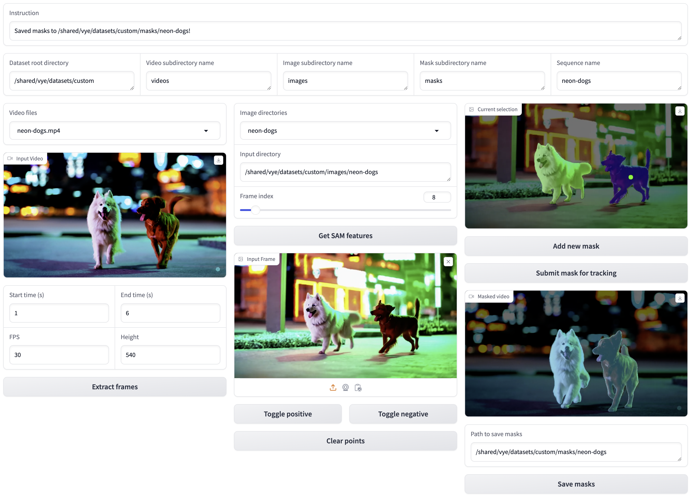

We depend on the following third-party libraries for preprocessing:

1. Metric depth: [Unidepth](https://github.com/lpiccinelli-eth/UniDepth/blob/main/install.sh)
2. Monocular depth: [Depth Anything](https://github.com/LiheYoung/Depth-Anything)
3. Mask estimation: [Track-Anything](https://github.com/gaomingqi/Track-Anything) (Segment-Anything + XMem)
4. Camera estimation: [DROID-SLAM](https://github.com/princeton-vl/DROID-SLAM/tree/main)
5. 2D Tracks: [TAPIR](https://github.com/google-deepmind/tapnet)

## Installation

We provide a setup script in `setup_dependencies.sh` for updating the environment for preprocessing, and downloading the checkpoints.
```
./setup_dependencies.sh
```

## Processing Custom Data

We highly encourage users to structure their data directories in the following way:
```
- data_root
    '- videos
    |   - seq1.mp4
    |   - seq2.mp4
[and/or]
    '- images
    |   - seq1
    |   - seq2
    '- ...
```

Once you have structured your data this way, run the gradio app for extracting object masks:
```
python mask_app.py --root_dir [data_root]
```
This GUI can be used for extracting frames from a video, and extracting video object masks using Segment-Anything and XMEM. Follow the instructions in the GUI to save these.


To finish preprocessing, run
```
python process_custom.py --img-dirs [data_root]/images/** --gpus 0 1
```

The resulting file structure should be as follows:
```
- data_root
    '- images
    |   - ...
    '- masks
    |   - ...
    '- unidepth_disp
    |   - ...
    '- unidepth_intrins
    |   - ...
    '- depth_anything
    |   - ...
    '- aligned_depth_anything
    |   - ...
    '- droid_recon
    |   - ...
    '- bootstapir
        - ...
```

Now you're ready to run the main optimization!

### Individual launch scripts
If you'd like to run any part of the preprocessing separately, we've included the launch scripts `launch_depth.py`, `launch_metric_depth.py`, `launch_slam.py`, and `launch_tracks.py` for your convenience. Their usage is as follows:

```
python launch_depth.py --img-dirs [data_root]/images/** --gpus 0 1 ...
```
and so on for the others.

### A note on TAPIR
By default, we use the pytorch implementation of TAPIR in `tapnet_torch`. This is slightly slower than the Jax jitted version, in the `tapnet` submodule. We've included the Jax version of the script `compute_tracks_jax.py` in case you want to use and install `tapnet` and the Jax dependencies. Please refer to the [TAPNet readme](./tapnet/README.md) for those installation instructions. 
